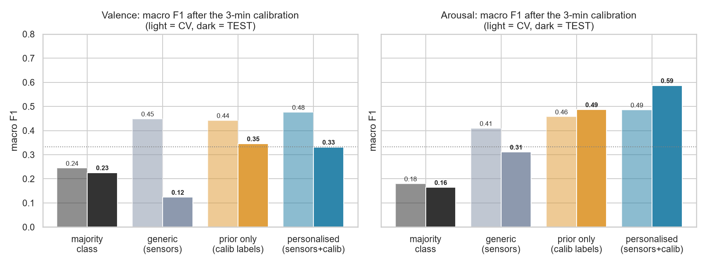
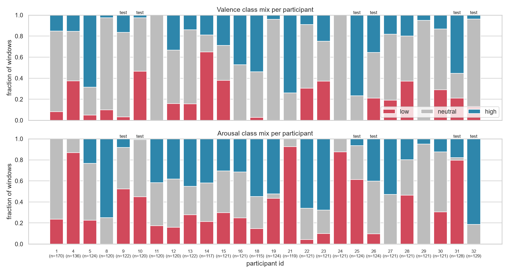

# Human-Technology Interaction: Emotion-Aware Chatbot

**Goal:** while a person talks to an LLM chatbot in the lab, estimate their emotional state (valence and arousal) from signals such as body sensors, voice or text. The chatbot then receives a short, **interpretable** description of that state, never raw sensor readings. The description is stored in the chatbot's project memory so it can adapt to the person.

```
sensors / voice / text ──► emotion estimator ──► "arousal: high (confident), valence: unknown"
                                                        │
conversation ──► summary ───────────────────────────────┴──► LLM memory ──► adapted responses
```

A core requirement is that **every estimator must be able to say "unknown"**. A missing answer is better than a wrong one.

---

## ▶ Start here

| What | Link |
|---|---|
| 📓 **Walkthrough notebook**: the full story (problem → data → model → results → conclusions) with all charts | [`approaches/kemocon_physio_ml/notebooks/walkthrough.ipynb`](approaches/kemocon_physio_ml/notebooks/walkthrough.ipynb) · [open in nbviewer](https://nbviewer.org/github/MudasirRasheed1/Human-Technology-Interaction/blob/main/approaches/kemocon_physio_ml/notebooks/walkthrough.ipynb) if GitHub doesn't display it |
| 📊 Results write-up | [`approaches/kemocon_physio_ml/reports/RESULTS.md`](approaches/kemocon_physio_ml/reports/RESULTS.md) |
| 🗂️ Dataset documentation (every column, how and why) | [`approaches/kemocon_physio_ml/docs/DATASET.md`](approaches/kemocon_physio_ml/docs/DATASET.md) |
| 📚 Datasets, pretrained models and papers found | [`docs/literature_review.md`](docs/literature_review.md) |

## Results so far

| Approach | Owner | Data | Result on people the model has never seen |
|---|---|---|---|
| [`kemocon_physio_ml`](approaches/kemocon_physio_ml/) | Mudasir | K-EmoCon debates, E4 wristband + EEG | **Arousal:** 60% accuracy on 3 classes (69% on the 28% of windows it answers confidently) vs 33% for always predicting the most common class, *with* a 3-min per-person calibration. **Valence:** not predictable from body sensors |



*Macro-F1 after a 3-minute calibration (light = cross-validation on training people, dark = held-out test people). Only arousal with sensors + calibration clearly beats the baselines.*



*Why it's hard: each bar is one person, and most of the rating variation comes from **who** is rating, not from what their body is doing.*

---

## Repository layout

```
Human-Technology-Interaction/
├── README.md                     ← you are here
├── docs/
│   ├── evaluation_protocol.md    how every approach must be evaluated (read before training anything)
│   ├── emotion_state_format.md   common output format, so approaches can be swapped and compared
│   └── literature_review.md      datasets, pretrained models and papers found so far
└── approaches/
    ├── README.md                 index of all approaches, owners and headline results
    ├── kemocon_physio_ml/        K-EmoCon, wearable sensors → ML classifier (Mudasir)
    │   ├── notebooks/            walkthrough.ipynb
    │   ├── reports/              RESULTS.md, figures/, results.json
    │   ├── docs/                 DATASET.md
    │   └── src/                  dataset builder, features, training
    └── _template/                empty skeleton: copy it to start a new approach
```

Datasets and trained models are **never committed** (see `.gitignore`). Each approach's `data/README.md` explains how to obtain its data.

## Working together

1. **Start a new approach:** copy `approaches/_template/` to `approaches/<dataset>_<method>/` (lower case, underscores), then add a row to `approaches/README.md`.
2. **Use a branch** (`git checkout -b <your-name>/<approach>`) and open a pull request into `main`.
3. **Follow [`docs/evaluation_protocol.md`](docs/evaluation_protocol.md).** In particular, test on people the model has never seen and always report simple baselines, so results are comparable.
4. **Put one walkthrough notebook** in `approaches/<name>/notebooks/` that explains what was done, how, why, and the results.
