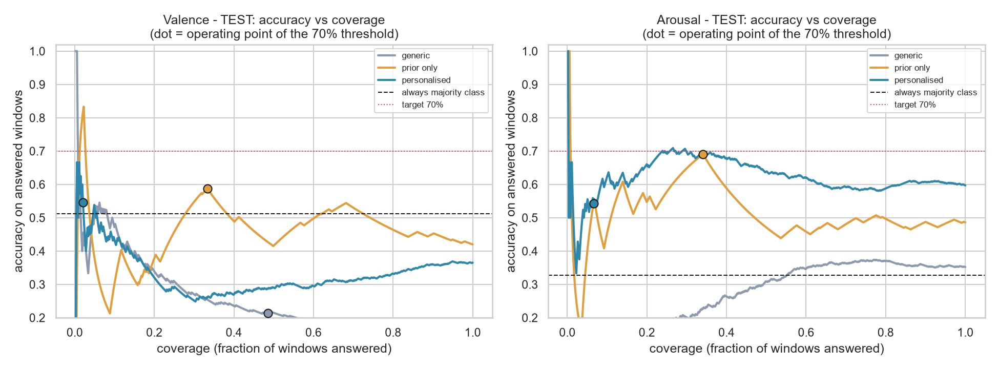
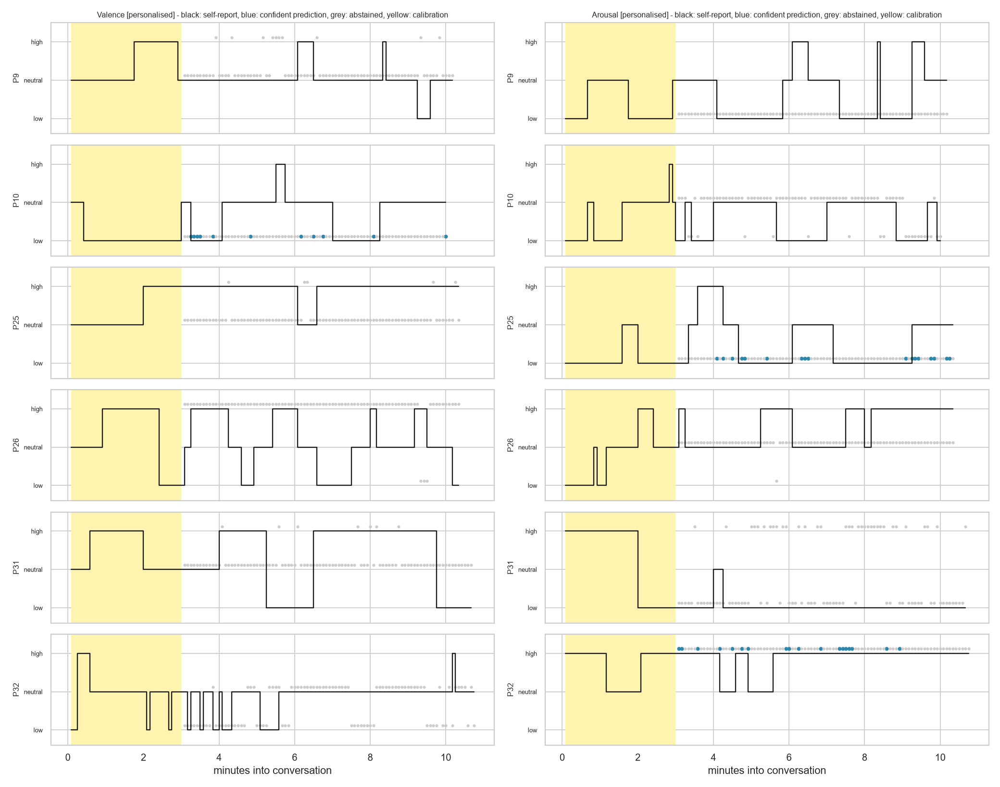

# K-EmoCon, wearable sensors → ML valence/arousal classifier

**Owner:** Mudasir · **Dataset:** K-EmoCon (32 people, 10-min debates) · **Inputs:** Empatica E4 wristband + NeuroSky EEG · **Status:** step 1 done

**Question:** can a model turn raw body-sensor data into valence and arousal, and abstain when unsure, for a person it has never seen?

**Answer:**
- **Arousal: yes, moderately, if the person does a 3-minute calibration at the start of the chat.** 60% accuracy on 3 classes, or 69% on the confident 28% of windows, vs. 33% for always predicting the most common class.
- **Valence: no.** Body sensors do not carry usable valence information here.
- A model with **no** calibration does not generalise to new people.

**Start here:** [`notebooks/walkthrough.ipynb`](notebooks/walkthrough.ipynb) tells the full story with all charts. If GitHub doesn't display it, use [nbviewer](https://nbviewer.org/github/MudasirRasheed1/Human-Technology-Interaction/blob/main/approaches/kemocon_physio_ml/notebooks/walkthrough.ipynb). Details are in [`docs/DATASET.md`](docs/DATASET.md) and [`reports/RESULTS.md`](reports/RESULTS.md).

## Key charts


*Macro-F1 of each approach (light = cross-validation, dark = held-out test people).*


*Abstaining when unsure: accuracy on the windows the model answers vs. the share it answers (test people).*


*Each test person: black = self-rating, blue = confident prediction, grey = abstained, yellow = 3-min calibration.*

All other charts are in [`reports/figures/`](reports/figures/).

## Layout

```
kemocon_physio_ml/
├── notebooks/walkthrough.ipynb   the whole story: problem → data → model → results → conclusions
├── docs/DATASET.md               every row/column of the dataset, how and why it was built
├── reports/
│   ├── RESULTS.md                model choice, results and interpretation
│   ├── results.json              all final numbers
│   ├── cv_*.csv                  full cross-validation tables
│   └── figures/                  all charts
├── src/
│   ├── config.py                 paths, constants, feature groups
│   ├── features.py               5 s window features + per-person normalisation (reusable live)
│   ├── build_dataset.py          raw K-EmoCon → windowed dataset + person-level split
│   ├── explore_dataset.py        dataset charts
│   ├── check_alignment.py        label/sensor timing sanity check
│   └── train.py                  model selection, abstention thresholds, test evaluation, charts
├── data/                         NOT committed; see data/README.md
├── models/                       NOT committed; created by train.py
└── requirements.txt
```

## Reproduce

```bash
python -m venv .venv
.venv/Scripts/pip install -r requirements.txt
# put K-EmoCon into data/raw/ (see data/README.md)
cd src
../.venv/Scripts/python build_dataset.py     # ~1 min
../.venv/Scripts/python explore_dataset.py
../.venv/Scripts/python check_alignment.py
../.venv/Scripts/python train.py --regrid    # ~25 min; the grid is cached afterwards
```
