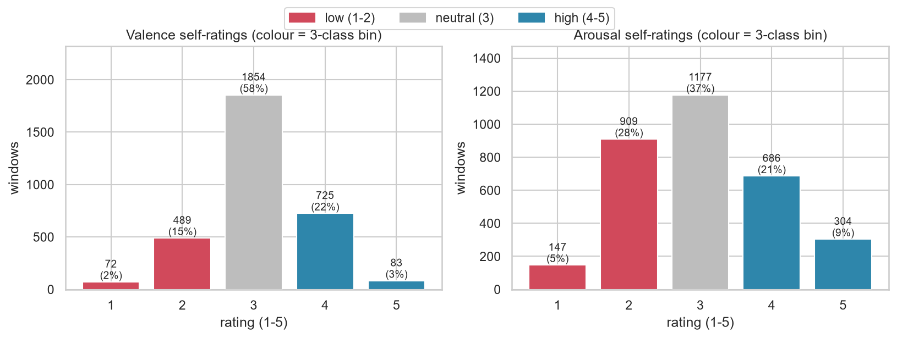
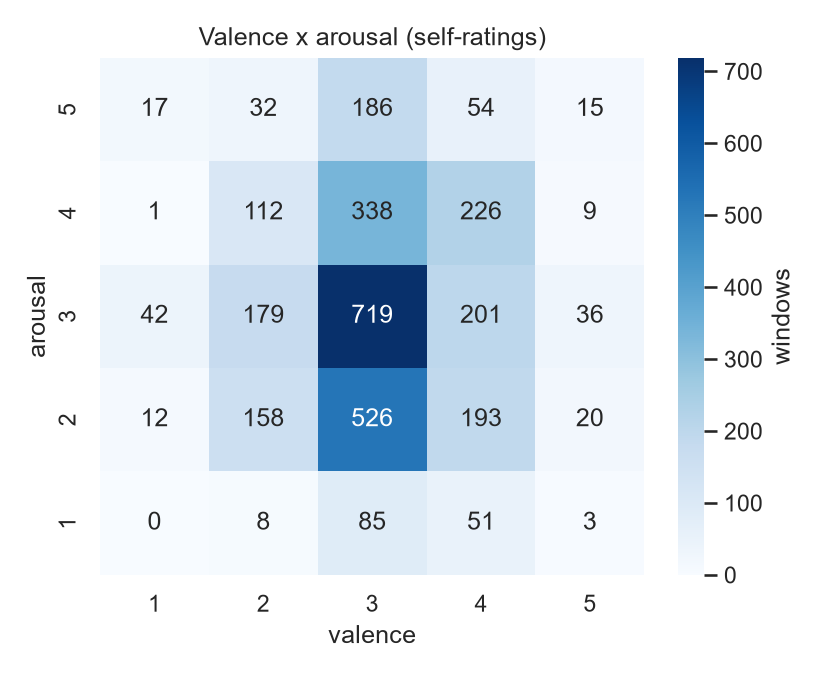
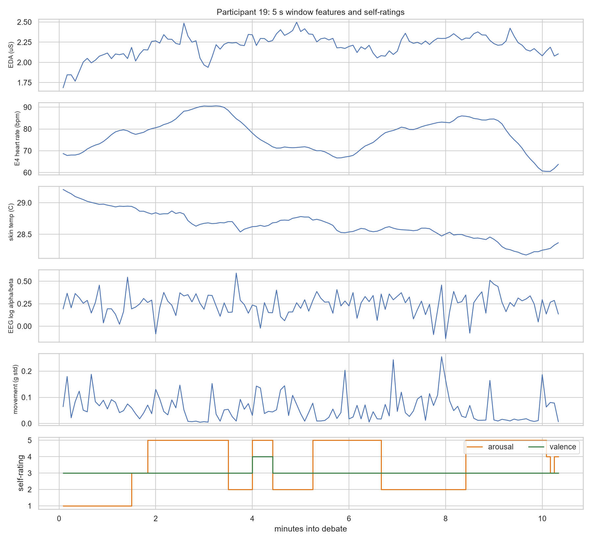
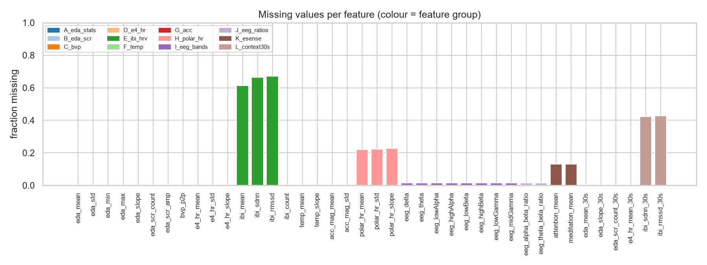
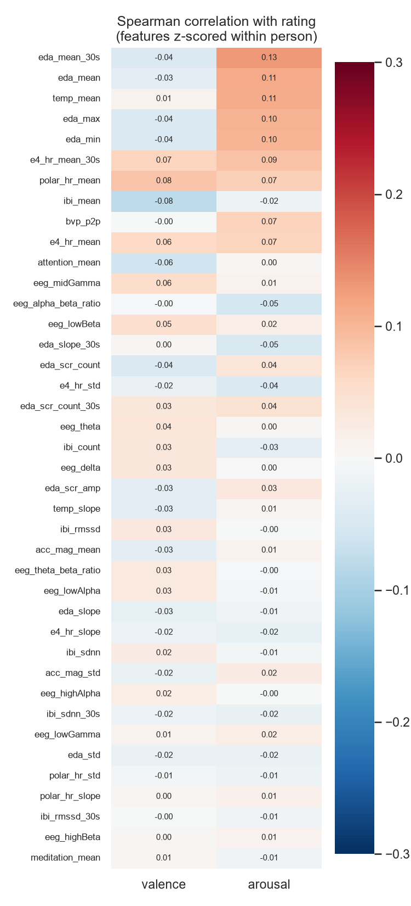
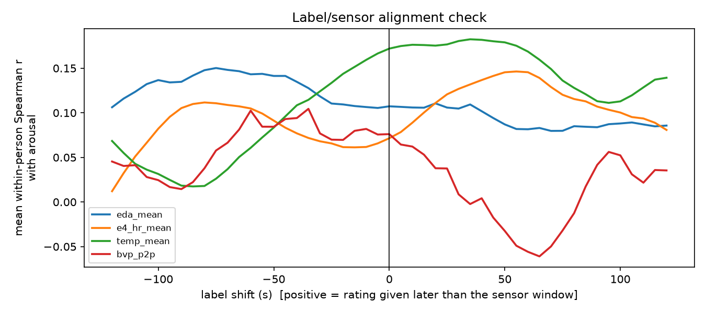

# Dataset: K-EmoCon windows for valence/arousal prediction

**File:** `data/processed/dataset.csv` (+ `train.csv`, `test.csv`)
**Shape:** **3,223 rows × 68 columns**, from **26 people**
**One row =** one **5-second window** of one person during a ~10-minute debate: 40 sensor features plus that person's own valence and arousal rating for those 5 seconds.
**Rebuild:** `.venv/Scripts/python src/build_dataset.py`

---

## 1. Source data

[K-EmoCon](https://doi.org/10.5281/zenodo.3931963) is a multimodal dataset of 32 people (16 pairs) holding ~10-minute debates on a social issue. While debating they wore:

| Device | Worn on | Signals used here | Sampling rate |
|---|---|---|---|
| **Empatica E4** | wrist | EDA (skin conductance), BVP (pulse wave), HR, IBI (beat-to-beat intervals), skin temperature, 3-axis accelerometer | 4 Hz, 64 Hz, 1 Hz, per beat, 4 Hz, 32 Hz |
| **Polar H7** | chest strap | Heart rate | 1 Hz |
| **NeuroSky MindWave** | forehead (single EEG channel) | 8 EEG band powers, Attention, Meditation (proprietary 0–100 scores) | ~1 Hz |

**Labels:** after the debate, each person watched a video of themselves. The video paused **every 5 seconds** and they rated how they felt in that clip: **arousal** (1 = very calm … 5 = very excited) and **valence** (1 = very negative … 5 = very positive), plus several categorical emotions. These are the **self-annotations**. Partner and external-observer ratings also exist but are not used (see §6).

Every sensor records **continuously** from the moment it is switched on (`initTime`, 4–18 minutes before the debate) until the debate ends (`endTime`). The IBI stream is the exception: it only logs a value when the wristband detects a clean heartbeat.

Raw data is in `data/raw/` (extracted from the K-EmoCon zip; the 1.7 GB debate audio was not extracted).

---

## 2. How a row is built

```
debate timeline:   |---- 5 s ----|---- 5 s ----|---- 5 s ----| ...
self-annotation:          (seconds=5)   (seconds=10)  (seconds=15)
                               │             │
row for seconds=10:  window = [start+5 s, start+10 s)
                     features = summary of every sensor sample inside that window
                              + trailing 30 s context for the slow signals
                     label    = the rating the person gave for that clip
```

1. **Align.** Each annotation `seconds = s` covers the interval `[debate_start + s − 5 s, debate_start + s)`.
2. **Clean.** A value of exactly `0` in EDA, HR, skin temperature, Polar HR, Attention or Meditation means "no skin contact / no reading", so it is set to missing. IBI values outside 300–2000 ms (30–200 bpm) are treated as artefacts.
3. **Summarise.** Each sensor's samples in the window (20 EDA samples, 320 BVP samples, 5 HR samples, …) are reduced to a few numbers: mean, standard deviation, slope and so on. See §4 for the exact definitions.
4. **Add context.** EDA, HR and heart-rate variability change slowly and are unreliable over only 5 s, so a few features are also computed over the **30 seconds ending at the window end** (`*_30s`). Only past data is used, so every feature is computable in real time.
5. **Filter.** A window is kept only if at least 50% of its EDA samples are valid. EDA is the most important arousal signal, and without it the wristband is not on the skin.
6. **Baseline.** The same features are computed for 36 consecutive 5 s windows covering the **3 minutes before the debate starts**. Their per-person mean and standard deviation are stored in `baseline_stats.csv`. Training uses them to express every feature relative to that person's own pre-debate state, because resting EDA differs ~300× between people and resting HR by 40+ bpm.

**Why summarise over the window instead of taking one instant?**
- The label describes the whole 5 s.
- A single raw sample (e.g. one point of the pulse wave) has no meaning on its own.
- The body reacts with a 1–3 s lag.
- The sensors tick at different rates, so there is no common instant.
- Summaries over 20–320 samples are far less noisy than a single reading.

---

## 3. Who is in the dataset

| | People | Rows |
|---|---|---|
| K-EmoCon total | 32 | 4,159 labelled 5 s clips |
| No E4 wristband data at all (P2, P3, P6, P7) | −4 | −562 |
| EDA sensor had no skin contact for the whole debate (P17: 132/132 windows, P20: 124/144) | −2 | −256 |
| Annotation continues after the sensor recording ended (P1, P19, P20, P23–P26) | 0 | −102 |
| A few windows with < 50 % EDA (P1, P18, P23–P26) | 0 | −16 |
| **Final dataset** | **26** | **3,223** (115–170 per person) |

### Train / test split

Split **by debate pair**. Two partners share the same debate, topic and timeline, so they always go to the same side. The model is therefore always tested on people it has never seen, whose conversation it has never seen either. That matches the real use case: a new person talking to the chatbot.

| Split | People | Rows | Valence low / neutral / high | Arousal low / neutral / high |
|---|---|---|---|---|
| **train** | 20: P1, 4, 5, 8, 11, 12, 13, 14, 15, 16, 18, 19, 21, 22, 23, 24, 27, 28, 29, 30 | 2,476 | 17% / 60% / 23% | 30% / 38% / 32% |
| **test** | 6: P9, 10, 25, 26, 31, 32 (pairs 5, 13, 16) | 747 | 17% / 51% / 32% | 41% / 32% / 26% |

The test pairs were drawn at random (seed 42) from pairs where both members have usable data. The test set is used **once**, for the final evaluation. All model choices are made with cross-validation inside the training people (see `reports/RESULTS.md`).

---

## 4. Column dictionary

### Identifiers (not model inputs)

| Column | Meaning |
|---|---|
| `pid` | participant id (1–32) |
| `pair` | debate pair id = ⌈pid/2⌉; the unit used for splitting |
| `window_start_s`, `window_end_s` | window position in seconds from debate start |

### Sensor features (model inputs, 40 columns)

"slope" = least-squares linear trend over the window, in units per second. "missing" = share of the 3,223 rows where the value is empty (the model handles empty values).

| Group | Column | Sensor | Unit | How it's computed | Why it's there | Missing |
|---|---|---|---|---|---|---|
| **A** EDA level | `eda_mean` | E4 EDA (4 Hz) | µS | mean of the 20 samples | Tonic sweat level: the classic **arousal** marker | 0% |
| | `eda_std` | E4 EDA | µS | standard deviation | Within-window fluctuation | 0% |
| | `eda_min`, `eda_max` | E4 EDA | µS | min / max | Range | 0% |
| | `eda_slope` | E4 EDA | µS/s | linear trend | Rising EDA = building arousal | 0% |
| **B** EDA responses | `eda_scr_count` | E4 EDA | count | number of skin-conductance responses (peaks of the 1 s-smoothed EDA with prominence ≥ 0.01 µS, detected over the last 30 s) whose peak falls inside the window | Short sweat bursts triggered by something stimulating or stressful | 0% |
| | `eda_scr_amp` | E4 EDA | µS | mean amplitude of those responses (0 if none) | Strength of the response | 0% |
| **C** Pulse | `bvp_p2p` | E4 BVP (64 Hz) | a.u. | 95th − 5th percentile of the 320 samples | Pulse amplitude; blood vessels constrict under stress | 0% |
| **D** Heart rate | `e4_hr_mean` | E4 HR (1 Hz) | bpm | mean | Heart rate rises with arousal | 0% |
| | `e4_hr_std` | E4 HR | bpm | standard deviation | Short-term variability | 0% |
| | `e4_hr_slope` | E4 HR | bpm/s | linear trend | Accelerating or decelerating | 0% |
| **E** Heart-rate variability | `ibi_mean` | E4 IBI (per beat) | ms | mean beat-to-beat interval (valid beats only) | Inverse of heart rate, beat-accurate | 61% |
| | `ibi_sdnn` | E4 IBI | ms | standard deviation of the intervals (≥ 2 beats) | HRV: lower under stress | 66% |
| | `ibi_rmssd` | E4 IBI | ms | root-mean-square of differences between truly successive beats | Parasympathetic ("rest and digest") activity | 67% |
| | `ibi_count` | E4 IBI | beats | number of clean beats detected | Signal quality; drops when the wrist moves | 0% |
| **F** Skin temperature | `temp_mean` | E4 TEMP (4 Hz) | °C | mean | Peripheral temperature drops under stress | 0% |
| | `temp_slope` | E4 TEMP | °C/s | linear trend | Direction of change | 0% |
| **G** Movement | `acc_mag_mean` | E4 ACC (32 Hz) | g | mean of √(x²+y²+z²)/64 | Posture / gravity reference (~1 g) | 0% |
| | `acc_mag_std` | E4 ACC | g | standard deviation of the magnitude | Gesturing and fidgeting. Also flags motion artefacts in the other wrist signals | 0% |
| **H** Chest HR | `polar_hr_mean`, `polar_hr_std`, `polar_hr_slope` | Polar H7 (1 Hz) | bpm | as in D | More accurate HR than the wrist, especially during movement | 22% (6 people have no Polar data) |
| **I** EEG bands | `eeg_delta`, `eeg_theta`, `eeg_lowAlpha`, `eeg_highAlpha`, `eeg_lowBeta`, `eeg_highBeta`, `eeg_lowGamma`, `eeg_midGamma` | NeuroSky BrainWave (~1 Hz) | log₁₀ power | mean of log₁₀(power + 1) over the window | Brain activity; alpha ≈ relaxed, beta ≈ engaged/alert, theta ≈ drowsy/meditative | 1% |
| **J** EEG ratios | `eeg_alpha_beta_ratio` | NeuroSky | log ratio | mean of log₁₀((lowα+highα+1)/(lowβ+highβ+1)) | Relaxation vs. engagement | 1% |
| | `eeg_theta_beta_ratio` | NeuroSky | log ratio | mean of log₁₀((θ+1)/(lowβ+highβ+1)) | Attention / arousal index | 1% |
| **K** eSense | `attention_mean`, `meditation_mean` | NeuroSky eSense (1 Hz) | 0–100 | mean | Vendor's black-box focus and calm scores | 13% (P1, P20 have none) |
| **L** 30 s context | `eda_mean_30s`, `eda_slope_30s` | E4 EDA | µS, µS/s | mean and trend over the last 30 s | Slower, more stable arousal trend | 0% |
| | `eda_scr_count_30s` | E4 EDA | count | skin-conductance responses in the last 30 s | Response rate | 0% |
| | `e4_hr_mean_30s` | E4 HR | bpm | mean over the last 30 s | Stable HR level | 0% |
| | `ibi_sdnn_30s`, `ibi_rmssd_30s` | E4 IBI | ms | as in E, over the last 30 s | HRV needs more than 5 s of beats to be meaningful | 42–43% |

### Quality columns (not model inputs)

| Column | Meaning |
|---|---|
| `q_eda_frac` | fraction of the expected 20 EDA samples that were valid (≥ 0.5 by construction) |
| `q_eeg_n` | number of EEG packets in the window (normally 5) |

### Labels

| Column | Values | Meaning |
|---|---|---|
| `valence` | 1–5 | self-rated pleasantness (1 = very negative, 5 = very positive) |
| `arousal` | 1–5 | self-rated activation (1 = very calm/sleepy, 5 = very excited/agitated) |
| `valence_cls`, `arousal_cls` | 0 / 1 / 2 | **model targets**: 0 = low (1–2), 1 = neutral (3), 2 = high (4–5) |

### Auxiliary emotion labels (not used for training; kept for a later chatbot-context step)

| Columns | Values |
|---|---|
| `aux_cheerful`, `aux_happy`, `aux_angry`, `aux_nervous`, `aux_sad` | 1–4 self-rated intensity |
| `aux_boredom`, `aux_confusion`, `aux_delight`, `aux_concentration`, `aux_frustration`, `aux_surprise`, `aux_confrustion`, `aux_contempt`, `aux_dejection`, `aux_disgust`, `aux_eureka`, `aux_pride`, `aux_sorrow` | 1 = the person marked this emotion for the clip, 0 = not marked |

---

## 5. What the data looks like



Valence is heavily centred on "3": **57% of all windows are neutral**. People rarely rate a debate as strongly negative or positive. Arousal is spread more evenly.




People use the scale very differently. Some rate almost everything neutral; others use mostly high or low values. This is one reason predicting for an unseen person is hard.



Participant 19: the heart-rate peak at minutes 2–3.5 coincides with a stretch rated arousal 5. But at minutes 5.3–6.7 arousal is also rated 5 while heart rate is at its lowest. Even within one person, the body-to-rating link is real but inconsistent.





Even after removing person-to-person differences, **no single feature correlates with the ratings by more than |ρ| ≈ 0.13**. The strongest links are the physiologically expected ones: EDA level, skin temperature and heart rate go up with **arousal**. Valence has much weaker physiological signatures, which is well known in the literature.



**Timing check** (`src/check_alignment.py`): each person's arousal ratings were shifted by up to ±2 minutes relative to their sensor features, and the within-person correlation was measured at each shift. It stays roughly flat (~0.1–0.17) across the whole range, with no sharp peak at 0. There is no sign of a clock offset. But it also shows that the body–rating link is a **slow trend over minutes**, not a quick 5-second reaction. Ratings themselves stay the same for minutes at a time.

---

## 6. Decisions and their reasons

| Decision | Reason |
|---|---|
| Self-ratings, not partner/observer ratings | The chatbot should respond to what the person *feels*, not how they look to others |
| 3 classes instead of 1–5 | ~3k rows is too little to tell a "2" from a "1" reliably. Also, class probabilities give a natural confidence score for abstaining |
| 5 s windows | This is the resolution of the labels |
| 30 s context features | HRV and EDA trends need more than 5 s to be measured reliably; only past data is used |
| Missing values kept as empty, rows not dropped | Dropping every row with a missing IBI would lose ~65% of the data; tree models handle empty values |
| All sensor groups kept in the file | Model selection (E4 only vs. + EEG vs. all) is done in training, so the file supports every option |
| 3-min pre-debate baseline | Gives a per-person reference that is also available live (record ~3 min before the chat) |
| Split by debate pair | Prevents the model from being tested on a person, or a conversation, it has already seen |

## 7. Known limitations

- **Small:** 26 people, 3.2k windows. Neighbouring windows from the same person are highly correlated, so the effective sample size is much smaller.
- **Retrospective labels:** people rated their feelings while re-watching the video, not in the moment.
- **Pre-debate baseline:** according to Zitouni et al. (2023), participants watched a 2-minute relaxing video before the debate. That video sits inside our 3-minute pre-debate window, but its exact timestamps are not in the metadata, so the window may also contain setup time. In your lab, a scripted 3-minute seated rest (or the same kind of relaxing video) gives a cleaner baseline.
- **Speaking is a confound:** talking raises HR and movement independently of emotion, and turn-taking isn't marked in the data.
- **Consumer-grade EEG:** a single frontal channel, prone to muscle and eye artefacts.
