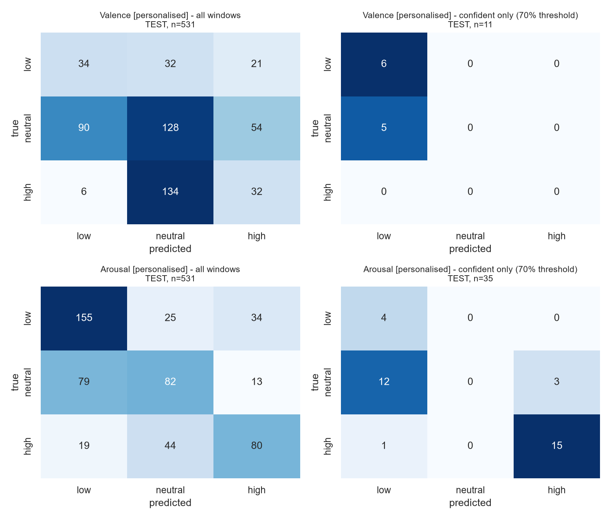
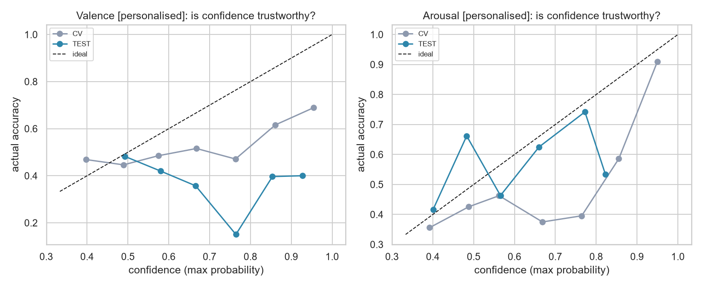
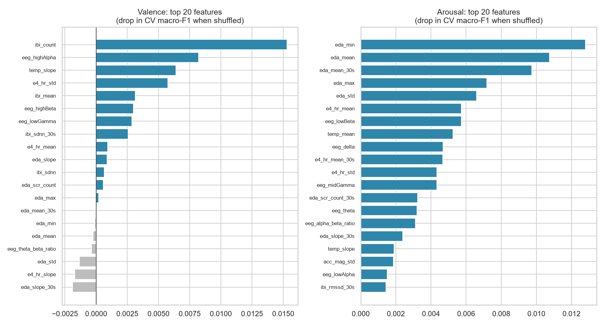
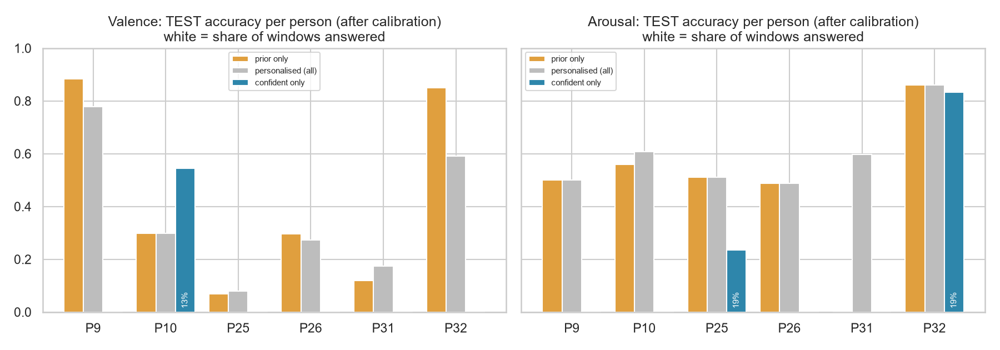

# Results: predicting valence and arousal from body sensors

**Data:** `data/processed/` (see [docs/DATASET.md](../docs/DATASET.md)). 20 training people (2,476 windows) and 6 test people (747 windows), split by debate pair.
**Code:** `src/train.py`. Every number below is in `reports/results.json`; the full cross-validation tables are in `reports/cv_*.csv`.

## TL;DR

| | Arousal | Valence |
|---|---|---|
| Can a **generic** model (never seen the person) predict it? | **No.** Test accuracy 35%, the same as always guessing the most common class (33%) | **No.** Worse than chance on test |
| With a **3-minute calibration** at the start of the chat? | **Yes, moderately.** **60% accuracy / 0.59 macro-F1** on unseen people (chance 33%). Low and high are almost never confused | **No.** Sensors add nothing beyond the person's own calibration ratings |
| Does "only answer when confident" work? | **Partly.** Ranking by confidence works on test: the 25% most-confident windows are **69% correct**. But probability thresholds tuned in CV did not transfer: the 70% target gave 54% on test with only 7% coverage | Confidence is not meaningful for valence |

**Recommendation for the pipeline:**
1. Use the **personalised arousal model** (Random Forest on E4 + EEG features, combined with the person's calibration ratings) and report arousal only when confident.
2. Don't use body sensors for valence. Get valence from **what the person says** (the LLM already sees the text), which is far more reliable for pleasantness/negativity.

---

## 1. What was trained

**Task:** two separate 3-class classifiers, one for valence and one for arousal, each predicting **low (1–2) / neutral (3) / high (4–5)** from one 5-second window of sensor features. The output is three probabilities; **confidence = the highest probability**. When confidence is below a threshold, the model abstains.

### Candidates (all compared fairly)

| Dimension | Options |
|---|---|
| Model | Logistic regression (linear baseline), **Random Forest** (300 trees, min 10 samples per leaf), **LightGBM** (gradient-boosted trees, 250 shallow trees). All use class-balanced weights |
| Feature set | **E4** only (25 features) · **E4+EEG** (35) · **ALL** (+ Polar HR, NeuroSky Attention/Meditation; 40) |
| Per-person normalisation | **none** · **baseline** (z-score against the 3 minutes *before* the conversation) · **calib** (z-score against the first 3 minutes *of* the conversation; no labels needed) |
| Deployment scenario | **generic:** new person, nothing known · **personalised:** the first 3 min (36 windows) are a calibration phase in which the person also self-reports; their rating tendencies are combined with the model: `p(class) ∝ p_model(class | sensors) × p_person(class)` |
| References | **majority class** (always predict the most common class) · **prior only** (ignore sensors; always predict from the person's calibration ratings) |

That's 27 sensor configurations × 2 scenarios × 2 targets.

### Why tree models
- The features have very different scales and missing values (IBI is empty in 60% of windows). Trees handle both without imputation tricks.
- They capture non-linear effects such as "high EDA *and* low movement".
- They don't need much data.

A deep sequence model (LSTM or transformer on raw signals) would overfit badly with 20 training people.

### Protocol (why the numbers can be trusted)
1. **Model selection used cross-validation inside the 20 training people only**, leaving one debate pair out at a time (13 folds). Every CV prediction is for a person the model never saw.
2. The best configuration per scenario was chosen by CV macro-F1. Confidence thresholds were chosen on the CV predictions.
3. The chosen models were refitted on all 20 training people and **evaluated once on the 6 test people**.
4. Personalised, prior-only and generic are all scored on the **same windows**: everything after each person's 3-minute calibration (531 test windows).

*Transparency note:* an earlier run (generic scenario only) crashed after producing one test number for valence, and it showed the generic approach failing. That prompted adding the personalised scenario. Its design (3-min calibration, prior combination) was fixed before any of its test results were seen, and nothing was tuned on test afterwards.

**Metrics:**
- **Accuracy:** share of windows correct.
- **Macro-F1:** the average F1 over the three classes. It doesn't reward always predicting the majority class; chance is ≈ 0.33.
- **Coverage:** the share of windows the model answers instead of abstaining.

---

## 2. Main results

### Arousal

| Approach | Config chosen by CV | CV macro-F1 (± spread across pairs) | CV acc | **TEST macro-F1** | **TEST acc** |
|---|---|---|---|---|---|
| Majority class | always "neutral" | 0.18 | 37% | 0.16 | 33% |
| Generic | E4+EEG, no norm, Random Forest | 0.41 ± 0.09 | 42% | 0.31 | 35% |
| Prior only | calibration ratings | 0.46 | 46% | 0.49 | 49% |
| **Personalised** | **E4+EEG, no norm, Random Forest + calibration prior** | **0.49 ± 0.12** | **49%** | **0.59** | **60%** |

### Valence

| Approach | Config chosen by CV | CV macro-F1 | CV acc | **TEST macro-F1** | **TEST acc** |
|---|---|---|---|---|---|
| Majority class | always "neutral" | 0.24 | 58% | 0.23 | 51% |
| Generic | E4+EEG, no norm, Random Forest | 0.45 ± 0.15 | 53% | **0.12** | **17%** |
| Prior only | calibration ratings | 0.44 | 54% | 0.35 | 42% |
| Personalised | E4+EEG, no norm, Logistic Regression + prior | 0.48 ± 0.11 | 58% | 0.33 | 37% |

### What this means
- **The generic model does not generalise to new people.**
  - Its CV scores look acceptable (0.41–0.45), but the error bars are large and the test scores collapse.
  - The reason is in the data: most of the variation in the ratings is *between people* (rating style). For example, P4 and P24 rated ~90% of the time as low arousal, and P32 81% high; see `figures/data_labels_per_participant.png`. A model meeting a stranger can't know their style.
- **Calibration fixes the rating-style problem, and for arousal the sensors add real information on top.**
  - Personalised arousal beats prior-only by **+11 accuracy points on test** (+3.5 in CV) and is the best approach in both.
  - The clearest example is **P31**: during calibration they rated high arousal, then rated low for the rest of the debate. Prior-only gets **0%** for this person; the sensor model gets **60%**, because their physiology showed the drop.
- **Valence is not recoverable from these body signals.** No approach beats the calibration ratings alone. This matches the literature: physiology tracks *activation* (sweat, heart rate) much better than *pleasantness*.
- **Arousal errors are mostly "neighbour" errors.** In the test confusion matrix below, the model confuses low vs. high in only 53 of 531 windows (10%). Most errors are neutral vs. low/high, which is also where people themselves are least certain.

---

## 3. Abstaining when unsure

The curve shows accuracy on the windows the model answers (y) as it answers more of them (x), going from the most confident windows to all windows.

**Arousal (personalised):**

| Answer only the… | TEST accuracy |
|---|---|
| top 25% most confident windows | **69%** |
| top 50% | **64%** |
| all windows | 60% |

So the confidence score **does rank windows correctly**: more confident means more often right.

**But fixed probability thresholds did not transfer from CV to test:**

| Threshold chosen in CV for… | CV result | TEST result |
|---|---|---|
| 60% accuracy (threshold p ≥ 0.72) | 43% coverage, 60% acc | **28% coverage, 69% acc** ✅ |
| 70% accuracy (p ≥ 0.81) | 29% coverage, 70% acc | 7% coverage, 54% acc ❌ |
| 80% accuracy | 17% coverage, 80% acc | 0% coverage (never answers) |

The reliability plot shows why. The model's probabilities are **not calibrated**: a "0.8 confident" prediction is right anywhere from ~40% (CV) to ~75% (test) of the time, depending on the group of people. With only 20 training people, the probability scale shifts from one group to the next.

**Practical consequences for the pipeline:**
1. Use the **60%-target threshold (p ≥ 0.72)** as the default operating point. On test it gave 69% accuracy while answering 28% of windows.
2. Better still, in the live system, **abstain based on rank within the session**. For example, answer only when the current window is among the person's top 25% most-confident windows so far. That relies on the ranking, which is what held up on test, rather than the absolute probability scale, which didn't.
3. Smoothing over time will also help. Ratings persist for minutes (see the timelines below), so requiring 3 consecutive agreeing confident windows (15 s) before reporting a state is cheap and removes flicker.

For valence, the confidence score has no relationship with correctness on test. That is another reason not to use sensor-based valence.

---

## 4. What the model looks at

The chart shows permutation importance: how much CV macro-F1 drops when a feature is shuffled.

- **Arousal:** the top five are all **EDA (skin conductance)** features (`eda_min`, `eda_mean`, `eda_mean_30s`, `eda_max`, `eda_std`), followed by heart rate, EEG low-beta and skin temperature. This is exactly the textbook physiology of arousal (the sympathetic nervous system), which is good evidence the model learned something real rather than noise.
- **Valence:** the importances are tiny and scattered (`ibi_count`, EEG high-alpha, temperature slope), which is consistent with there being no usable signal.
- The **Polar chest strap and NeuroSky Attention/Meditation (ALL set) never won**. **E4+EEG** was best for both targets, so the lab setup can skip the chest strap without losing accuracy.

---

## 5. Per-person behaviour

The timelines show each test person's self-reports (black), confident predictions (blue), abstentions (grey) and the calibration phase (yellow).

**An honest limitation is visible here.** Within one person, the arousal prediction is fairly **flat**: it mostly identifies the person's overall level (P9 low, P26 neutral, P32 high) rather than following every change minute by minute. That fits the earlier checks:
- Single features correlate with ratings at only |ρ| ≤ 0.17 within a person.
- The timing check (`figures/data_alignment_check.png`) shows the body–rating relationship is a slow trend over minutes, not a quick 5-second reaction.

So what the model reliably provides today is **"this person is currently in a calm / neutral / activated state"**, updated over minutes, not second-by-second emotional changes.

---

## 6. Saved models

| File | Contents |
|---|---|
| `models/arousal_personalised.joblib` | **Recommended.** Random Forest on E4+EEG features, class names, thresholds for 60/70/80% targets, calibration settings |
| `models/arousal_generic.joblib` | Generic arousal model (not recommended) |
| `models/valence_personalised.joblib`, `models/valence_generic.joblib` | Saved for completeness; not recommended for use |

Using the personalised model live:
1. Record the first 3 minutes of the chat and ask the person to rate their arousal (1–5) a few times.
2. Turn those ratings into class frequencies, Laplace-smoothed: `(count + 1) / (n + 3)`.
3. For every new 5 s window, compute features with `features.window_features`.
4. Compute `p = model.predict_proba(x) × prior`, then normalise it to sum to 1.
5. Report the class only if `max(p) ≥ threshold`. Otherwise report "unknown".

---

## 7. Limitations and next steps

**Limitations**
- **Small data:** 26 people. The test set has 6 people, so a single test number can move by ±10 points depending on who is in it. The CV numbers over 20 people are the more stable estimate.
- **Labels:** retrospective 5 s self-ratings, the same across a whole debate context, and heavily neutral for valence.
- **Setting:** a debate is a specific, fairly arousing situation. Chatting with an LLM will probably be calmer, so the model needs checking on lab data.
- **Speaking vs. listening** isn't marked in the data, and speaking itself raises heart rate and movement.

**Recommended next steps (for the end-to-end pipeline)**
1. **Arousal from sensors, valence from language.** Let the LLM judge valence from the transcript and combine it with sensor arousal into an emotional-state summary.
2. **Collect your own lab data** with the real setup: E4 + EEG headband, a scripted 3-minute seated rest as the baseline, plus occasional in-the-moment ratings during chats. Even 10–15 of your own sessions would allow fine-tuning, and in-the-moment labels will be much cleaner than retrospective ones.
3. **Rank-based abstention plus temporal smoothing** in the live loop, as described in §3.
4. Optionally, **binary arousal** (calm vs. activated, dropping "neutral"), where the model is most reliable (only 10% low-vs-high confusion).
